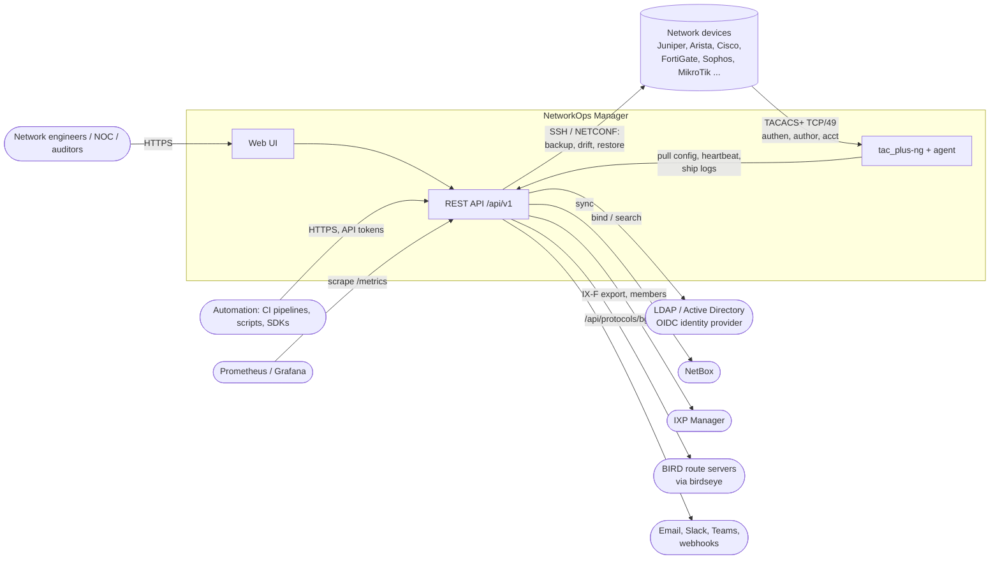
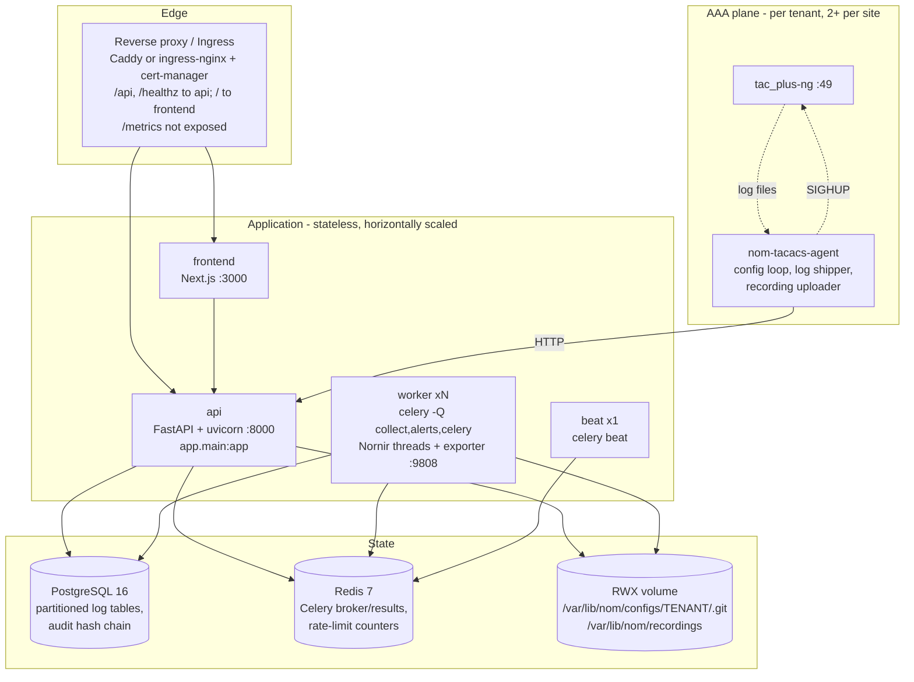
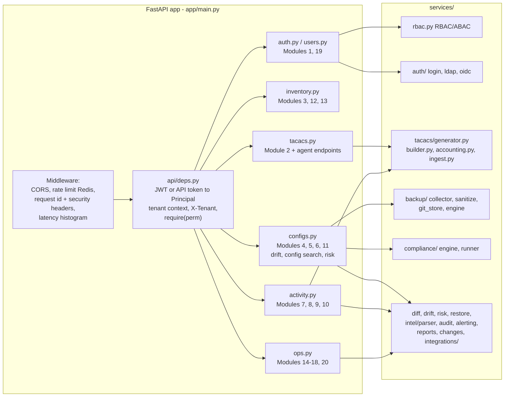
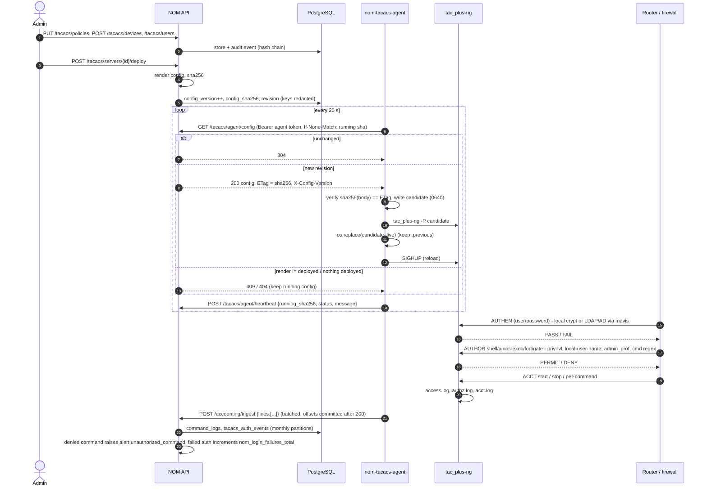
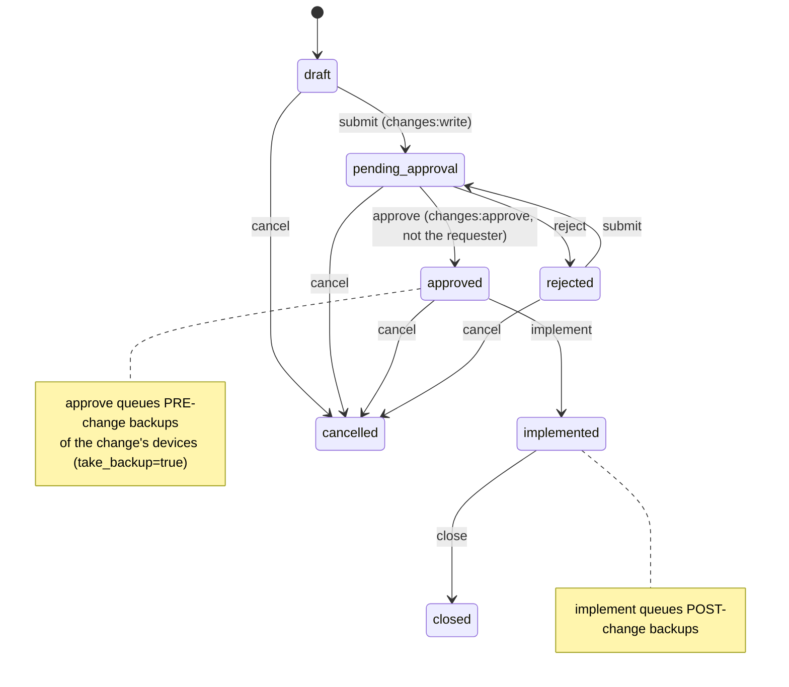
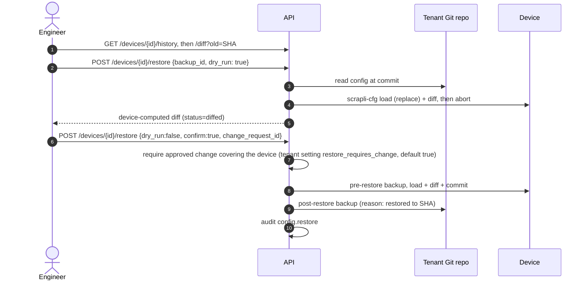
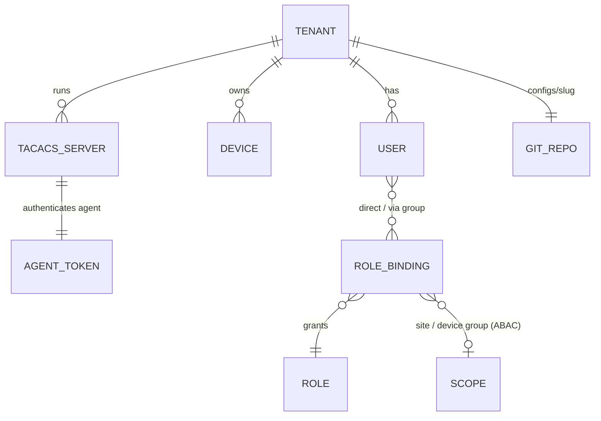

# Architecture

NetworkOps Manager (NOM) is a multi-tenant network access and configuration management platform
for ISPs, IXPs and MSPs. It combines TACACS+ AAA (tac_plus-ng), configuration backup in Git,
diff/drift/compliance, command accounting, session recording, change management and ISP/IXP
integrations (NetBox, IXP Manager, BIRD route servers via birdseye) behind one REST API and UI.

This document describes how the pieces fit together and how the platform scales. Statements
marked **(recommendation)** describe how to operate the platform; they are not implemented in
code.

- [1. System context](#1-system-context)
- [2. Containers and components](#2-containers-and-components)
- [3. Data flows](#3-data-flows)
- [4. Multi-tenancy model](#4-multi-tenancy-model)
- [5. Scaling to 10k devices / 100k TACACS authentications per day](#5-scaling)
- [6. Code map](#6-code-map)

## 1. System context

Who talks to whom:

| Actor | Protocol | Purpose |
|---|---|---|
| Users | HTTPS → UI → `/api/v1` | everything; JWT access + rotating refresh tokens, optional TOTP MFA, LDAP/AD or OIDC SSO |
| Automation | HTTPS `/api/v1` | API tokens (`nomt_...`), optionally scoped to a subset of the owner's permissions |
| Devices | TACACS+ (TCP/49) | authentication, per-command authorization, accounting against tac_plus-ng |
| TACACS agent | HTTPS `/api/v1/tacacs/agent/*`, `/accounting/ingest`, `/sessions` | pulls rendered config, heartbeats, ships logs and recordings (agent token) |
| Workers | SSH (Scrapli/Netmiko via Nornir) | config collection; restore uses scrapli-cfg (config replace) |
| Workers | HTTPS | NetBox, IXP Manager, birdseye, alert channels |

## 2. Containers and components

### API components (`backend/app`)

### Background jobs (`app/workers`)

| Task | Queue | Trigger (celery beat, UTC) |
|---|---|---|
| `run_backup_schedule` → fans out `backup_devices` (250 devices per task) | collect | hourly at :05 |
| `backup_devices` | collect | also manual (`POST /backups/run`), change approve/implement |
| `sync_all_integrations` → `sync_integration` | celery | every `NOM_NETBOX_SYNC_MINUTES` (15) |
| `run_compliance_all` | celery | daily 02:30 |
| `apply_retention` (drops monthly partitions; purges old unchanged/failed backup rows, recordings, alerts, login history) | celery | daily 03:15 |
| `refresh_metrics` (`nom_devices` gauge) | celery | every 5 min |
| `ensure_partitions` (3 months ahead) | celery | daily 00:10 |
| `run_report_schedules` | celery | hourly at :00 |
| `deliver_alert` | alerts | on alert emission |

Beat must run as **exactly one** instance (Kubernetes: `replicas: 1`, `strategy: Recreate`).

### Observability

`/metrics` on the API exposes the `nom_*` metrics defined in `app/services/metrics.py`. Counters
incremented inside Celery tasks (scheduled backups, compliance runs, integration syncs, alert
deliveries) live in the worker processes; the worker container runs a
`prometheus_client` multiprocess exporter on `:9808` (`backend/docker/metrics_exporter.py`,
started by `docker-entrypoint.sh`), which sums counters/histograms over all worker processes and
reports gauges with "latest write wins" per label set (so `nom_compliance_score` reflects the most
recent scheduled run, not a stale value held by another child process). Scrape both. Keep
`NOM_API_WORKERS=1` and scale the API with replicas: with several uvicorn workers per container
each process has its own counters and a scrape only sees one of them.

| Metric | Labels | Incremented by |
|---|---|---|
| `nom_user_logins_total` | method | portal logins (API) |
| `nom_login_failures_total` | source (`portal`, `tacacs`) | failed portal logins; failed TACACS authentications (ingest) |
| `nom_config_backups_total` | status, platform | every collection (API or worker) |
| `nom_config_backup_duration_seconds` | platform | collection time |
| `nom_compliance_failures_total` | severity | compliance runs |
| `nom_compliance_score` | tenant | gauge after each run |
| `nom_tacacs_requests_total` | kind, result | ingested tac_plus-ng records |
| `nom_config_drift_total` | kind | golden-config drift |
| `nom_alerts_total` | event_type, severity | alert emission |
| `nom_integration_sync_total` | kind, status | NetBox / IXP Manager / birdseye syncs |
| `nom_http_request_duration_seconds` | method, route, status | every API request |
| `nom_devices` | tenant, vendor | inventory size; recomputed every 5 min (`refresh_metrics`) and after device create/update/delete and NetBox syncs in the process that made the change (vendor = device vendor, else platform vendor, else `unknown`) |

Prometheus rules (`deploy/prometheus/alerts.yml`, mirrored as a `PrometheusRule`) cover backup
failures, compliance score drops, login-failure spikes, TACACS deploy errors, stalled ingest,
API error rate/latency and integration sync failures. A Grafana dashboard is provisioned from
`deploy/grafana/dashboards/networkops-overview.json`.

## 3. Data flows

### 3.1 TACACS+ authentication, authorization and accounting

Operators never edit `tac_plus-ng.cfg`. Policies, NAS clients and user mappings are edited via
the API (audited), rendered by `services/tacacs/generator.py` and explicitly deployed. The agent
on the TACACS host pulls only what was deployed.

Failure behaviour:

* Validation failure → the running file is kept, heartbeat `status=error` → alert
  `tacacs_deploy_failed` (critical) and `NomTacacsDeployErrors` in Prometheus.
* Reload failure → the previous file is restored and reloaded, heartbeat `error`.
* API unreachable → tac_plus-ng keeps serving the last good configuration from its volume; logs
  accumulate and are shipped (from the stored offsets) when the API is back.
* tac_plus-ng unreachable → devices use their configured fallback (second TACACS server, then
  local accounts - see [disaster-recovery.md](disaster-recovery.md#device-side-fallback)).

### 3.2 Configuration backup pipeline

```mermaid
flowchart LR
    beat[beat: backups-hourly :05] --> fan[run_backup_schedule<br/>per tenant: active + backup_enabled devices<br/>chunks of 250]
    fan -->|backup_devices.delay x N| q[(Redis queue 'collect')]
    q --> w[worker process]
    w --> nr[Nornir threaded runner<br/>NOM_BACKUP_CONCURRENCY=50 threads<br/>Scrapli if native driver else Netmiko]
    nr --> san[sanitize.prepare<br/>strip volatile lines, mask secrets]
    san --> cmp{same as<br/>HEAD file?}
    cmp -->|yes| rec1[ConfigBackup status=unchanged]
    cmp -->|no| corr[correlate author:<br/>last config command in<br/>TACACS accounting]
    corr --> commit[git commit per tenant repo<br/>author = engineer, trailers:<br/>Device, Reason, Change-Request, Trigger]
    commit --> rec2[ConfigBackup status=success<br/>+/- lines, risk score]
    rec2 --> idx[reindex config_index<br/>BGP neighbours, communities,<br/>prefix-lists, filters ...]
    rec2 --> gold[golden-config drift check]
    rec2 --> unpl[unplanned change alert<br/>if no change request]
    w -. failure .-> fail[ConfigBackup failed,<br/>backup_failed / device_unreachable alerts]
```

Details are in [backup-architecture.md](backup-architecture.md).

### 3.3 Change and restore workflow

Restore is supported on platforms with `supports_config_replace` (seeded: Junos, EOS, IOS/IOS-XE,
NX-OS).

### 3.4 Other flows (summary)

* **Accounting search** (`GET /accounting/commands`): substring (`ILIKE`, trigram GIN index) or
  regex (`~pattern`) over `command_logs`, with a dangerous-command classifier on each result.
* **Session recordings**: an SSH bastion/recorder drops asciicast v2 files in the agent's spool;
  the agent uploads them (`POST /sessions`); the API stores them under
  `<NOM_BACKUP_REPO_ROOT>/../recordings/<tenant-id>/` and indexes typed commands.
* **Integrations**: NetBox (sites, racks, devices, cables, VLANs, prefixes, IPs, VRFs, ASNs,
  contacts; optional push-back of serial/OS version), IXP Manager (IX-F member export), birdseye
  (route-server BGP sessions, accepted/filtered prefixes, IRR/RPKI filter reasons).
* **Alerts**: `emit_event` stores an `Alert`, matches `AlertRule`s (event type, min severity,
  throttling, dedup key) and queues delivery to email/Slack/Teams/webhook channels.

## 4. Multi-tenancy model

* **Row-level isolation in the application.** Every tenant-owned table has a non-null,
  indexed `tenant_id` (`TenantScoped` mixin). Every handler filters on the caller's tenant;
  `get_owned()` returns **404** (never 403) for objects of another tenant so existence does not
  leak. API tokens and refresh tokens are bound to their user and hence to the tenant.
* **Platform operators (MSP).** Users with `is_superuser` may send `X-Tenant: <slug>` to act
  inside another tenant; anyone else gets 403. Superusers hold every permission (still limited by
  API-token scopes).
* **Per-tenant stores.** Each tenant has its own Git repository
  (`NOM_BACKUP_REPO_ROOT/<tenant-slug>`), recording directory, compliance score gauge and its own
  TACACS servers. A TACACS server's agent token maps log ingest and recordings to that tenant, and
  the rendered tac_plus-ng configuration contains only that tenant's NAS clients, users and
  policies - **each tenant needs its own tac_plus-ng instance(s)** (own VIP or port).
* **Shared catalogue.** Permissions, built-in roles, vendors and platforms are global rows;
  tenants can add their own roles.
* **(recommendation)** For hard isolation requirements (regulatory separation) run one platform
  instance per tenant; PostgreSQL row-level security is not used.

## 5. Scaling

Reference target: **10,000 devices**, hourly configuration backups, **100,000 TACACS+
authentications per day** (~1.2/s average, ~15/s peak), ~1,000,000 accounting records/day.

### 5.1 Configuration collection

`run_backup_schedule` splits each tenant's devices into chunks of **250** (`chunk_size`) and
enqueues one `backup_devices` task per chunk. A task runs Nornir with
`NOM_BACKUP_CONCURRENCY` threads (default **50**), i.e. 50 parallel SSH sessions per worker
process. Git commits inside a task are sequential (only changed configs are committed).

| Quantity | Value |
|---|---|
| Tasks per hourly run | 10,000 / 250 = **40** |
| Time per task (50 threads, ~10 s per device incl. login + `show`) | 250 / 50 × 10 s ≈ **50–90 s** (large Junos `display set` configs: 30–60 s each → 3–5 min) |
| Concurrent tasks | worker pods × `NOM_WORKER_CONCURRENCY` (default 4) |
| 3 pods × 4 processes = 12 slots | 40 tasks in ⌈40/12⌉ = 4 waves ≈ **4–20 min** per hourly run |
| Parallel SSH sessions | 12 × 50 = **600** (mind device `maximum-sessions`/vty limits and jump hosts) |
| Worker memory | ~0.5–1 GB per process with 50 connections → 4–6 GiB per pod |

Scale knobs: more worker replicas (or KEDA on the `collect` list length, see
`deploy/k8s/components/keda`), `NOM_WORKER_CONCURRENCY`, `NOM_BACKUP_CONCURRENCY`. Keep the
whole run well inside the hour: tasks are not de-duplicated, so a run that takes longer than 60
minutes overlaps with the next one.

Git write concurrency: commits to one tenant repository are serialised by a thread lock plus an
`flock` on `.git/nom.lock` (works across processes and pods on the shared volume). Transient Git
or filesystem errors (`GitCommandError`, `OSError`) make `backup_devices` retry the chunk (up to 3
times, exponential backoff from 30 s with jitter); commits written by a failed attempt are adopted
by the retry (see [backup-architecture.md](backup-architecture.md#4-per-tenant-git-repositories)).

### 5.2 TACACS+ and accounting ingest

tac_plus-ng handles thousands of requests per second per instance; 15/s peak is negligible.
Size for availability, not throughput: **2+ instances per site/tenant** behind a VIP or listed
as separate servers on the devices (see [high-availability.md](high-availability.md)).

Note that the backup collector itself logs in to every device each hour: if the collection
account authenticates via TACACS+, 10,000 devices produce **240,000 authentications/day** plus
accounting for the collection commands. Either count them in, or use a local read-only account
for the collector.

Ingest path: the agent posts batches of up to `NOM_AGENT_BATCH_SIZE` (500) lines. Each ingest
request loads the tenant's device list once to correlate NAS addresses, so prefer larger batches
(1,000–2,000) for tenants with many devices. 1M lines/day ≈ 12 lines/s → one request every
~40 s per agent on average; peaks during the backup window are ~100 lines/s.

### 5.3 PostgreSQL sizing (partitioned log tables)

`command_logs`, `tacacs_auth_events` and `audit_events` are range-partitioned by month
(migration 0002); retention drops whole partitions (see [database.md](database.md)).

| Table | Rows/day | Size per row incl. indexes | Per month | Retention (default) | Steady state |
|---|---|---|---|---|---|
| `command_logs` (+ trigram GIN on `command`) | 1,000,000 | ~0.8–1.2 KB | 25–35 GB | 365 d | **300–420 GB** |
| `tacacs_auth_events` | 100,000–340,000 | ~0.3 KB | 1–3 GB | 365 d (uses the command-log retention) | 12–36 GB |
| `audit_events` | ~10,000 | ~1 KB (before/after JSON) | ~0.3 GB | 730 d | ~7 GB |
| `config_backups` (not partitioned) | 240,000 (10k × 24) | ~0.3 KB | ~2 GB | unchanged/failed rows 90 d (`NOM_RETENTION_BACKUP_ROWS_DAYS`); changed rows kept | ~6 GB + changed rows |
| `config_index` | replaced per changed device | | | current state only | 1–5 GB |

Old `status='unchanged'`/`'failed'` rows of `config_backups` (they only record that a poll
happened) are purged by `apply_retention`; rows that recorded a change are kept.

Connections: each API or worker process holds a SQLAlchemy pool of up to 40 connections
(`pool_size=20, max_overflow=20`). Budget `max_connections` ≥ API pods × 40 + worker processes ×
a few + headroom, or put PgBouncer (≥ 1.21 with `max_prepared_statements`, because psycopg 3
prepares statements) / a CloudNativePG `Pooler` in front for large deployments.

### 5.4 API

The API is stateless (JWTs, tokens and rate-limit counters in PostgreSQL/Redis, OIDC
`state`/PKCE verifier in Redis with a 10-minute TTL) and scales horizontally; the reference
Kubernetes deployment runs 3–12 replicas (HPA on CPU). Redis may be a Sentinel deployment
(`NOM_REDIS_SENTINELS`, see [high-availability.md](high-availability.md#redis)).

## 6. Code map

| Concern | Location |
|---|---|
| Settings (`NOM_*`) | `backend/app/core/config.py`, documented in `backend/.env.example` |
| App factory, middleware, `/healthz`, `/readyz`, `/metrics` | `backend/app/main.py` |
| AuthN/AuthZ dependencies | `backend/app/api/deps.py`, `backend/app/services/rbac.py` |
| TACACS render/deploy/agent endpoints | `backend/app/api/v1/tacacs.py`, `backend/app/services/tacacs/` |
| Backups, diffs, restore, drift, compliance, config search | `backend/app/api/v1/configs.py`, `backend/app/services/{backup,compliance,intel}/`, `diff.py`, `drift.py`, `restore.py`, `risk.py` |
| Accounting, recordings, audit, changes | `backend/app/api/v1/activity.py`, `backend/app/services/{audit,changes}.py` |
| Integrations, alerts, reports, dashboard, search | `backend/app/api/v1/ops.py`, `backend/app/services/{integrations,alerting.py,reports.py}` |
| Celery app + tasks | `backend/app/workers/` |
| Schema + partitioning | `backend/alembic/versions/0001_initial_schema.py`, `0002_partitioning.py` |
| TACACS agent | `tacacs-agent/src/nom_tacacs_agent/` |
| Deployment | `docker-compose.yml`, `deploy/k8s/`, `deploy/prometheus/`, `deploy/grafana/` |
| SDKs | `sdk/python`, `sdk/go/networkops`, `sdk/openapi-generator` |
