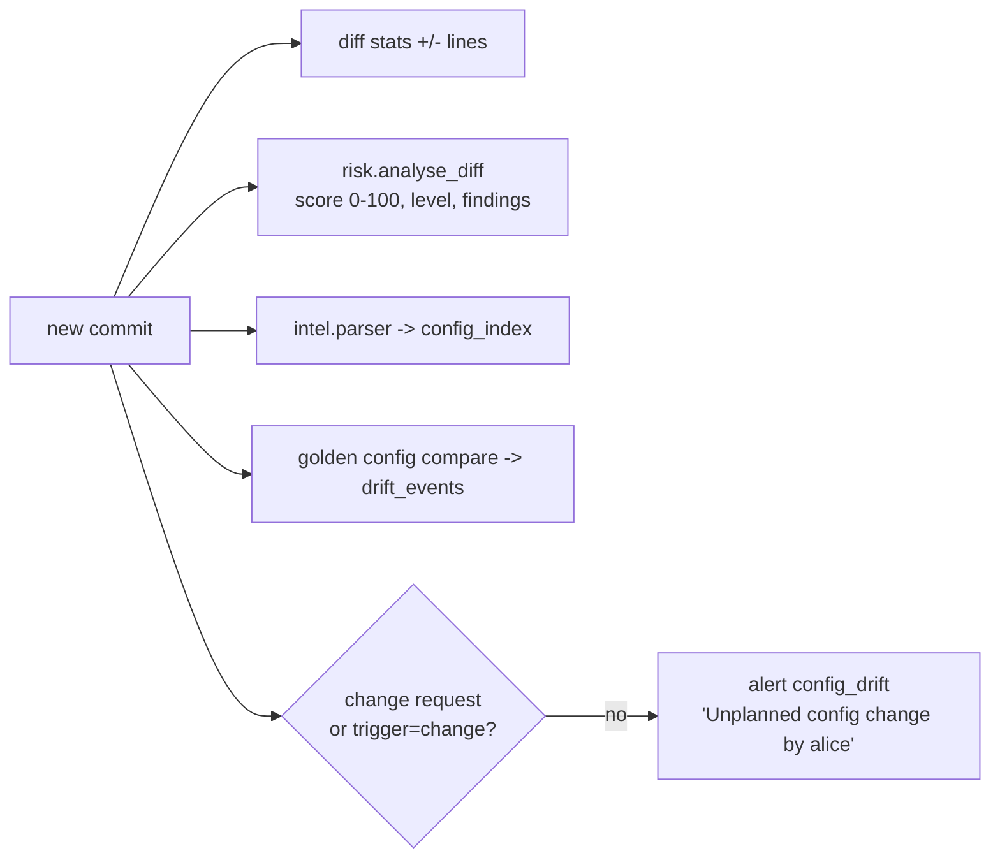

# Configuration backup architecture

How NetworkOps Manager collects, normalises, versions, indexes and analyses device
configurations (Modules 4, 5, 6, 11 + config intelligence, drift and change-risk analysis), and
how the platform's own data is backed up.

Code: `backend/app/services/backup/{collector,sanitize,git_store,engine}.py`,
`services/{diff,drift,risk}.py`, `services/intel/parser.py`, `workers/tasks.py`.

## 1. Triggers

| Trigger | `trigger` value | Path |
|---|---|---|
| Hourly schedule (celery beat `backups-hourly`, minute 5) | `schedule` | `run_backup_schedule` → `backup_devices` tasks on queue `collect` |
| Manual (UI / API `POST /api/v1/backups/run`) | `manual` | async task (default) or synchronous in the API (`run_async=false`) |
| Change request approve / implement | `change` | pre-/post-change snapshots with the change's devices, reason `CHG-<n> pre-change snapshot` |
| Restore | `change` | pre-restore snapshot and post-restore backup |

Only devices with `status = active` and `backup_enabled = true` are collected.
`run_backup_schedule` fans out **one task per 250 devices per tenant**, so a large estate spreads
over all collect workers (sizing: [architecture.md §5](architecture.md#51-configuration-collection)).

## 2. Collection (Nornir + Scrapli / Netmiko)

`nornir_collect()` builds an in-memory Nornir inventory from the targets and runs the threaded
runner with `NOM_BACKUP_CONCURRENCY` workers (default 50). Per device it uses **Scrapli** when the
platform has a native Scrapli driver, otherwise **Netmiko**, and runs the platform's
`backup_commands` (data-driven, stored in `platforms`):

| Platform slug | Driver | Command(s) | Config replace (restore) |
|---|---|---|---|
| `junos` | Scrapli `juniper_junos` | `show configuration \| display set \| no-more` | yes |
| `eos` | Scrapli `arista_eos` | `show running-config` | yes |
| `ios` (IOS / IOS-XE) | Scrapli `cisco_iosxe` | `show running-config` | yes |
| `nxos` | Scrapli `cisco_nxos` | `show running-config` | yes |
| `fortios` | Netmiko `fortinet` | `show` | no |
| `sfos` | Netmiko `sophos_sfos` | `show` | no |
| `routeros` | Netmiko `mikrotik_routeros` | `/export terse` | no |
| `vyos` | Netmiko `vyos` | `show configuration commands` | no |
| `linux` | Netmiko `linux` | `cat /etc/network/interfaces; cat /etc/bird/bird.conf` | no |

Credentials come from the device's `credential` (Fernet-decrypted in the worker: password, SSH
key, enable secret). Host keys are not verified (`auth_strict_key: False`) - **(recommendation)**
restrict the collectors' egress to the management network. Timeouts: 60 s socket/ops per device.
Failures are recorded per device (`status=failed`, error text) and raise `backup_failed` /
`device_unreachable` alerts; the rest of the chunk continues.

## 3. Normalisation and sanitisation

`sanitize.prepare(config, platform, NOM_BACKUP_SANITIZE_SECRETS)`:

1. **Volatile lines are stripped** (Oxidized-style) so an unchanged device never produces a
   commit: Junos `## Last commit: ...`, EOS `! Time:` / uptime, IOS `! Last configuration change`,
   `ntp clock-period`, `Building configuration`, NX-OS `!Time:`, FortiOS `#conf_file_ver`/`#buildno`,
   RouterOS export timestamps.
2. **Secrets are masked** (default on): Junos `encrypted-password`, `authentication-key`, `secret`,
   `$9$` keys; EOS/IOS/NX-OS `secret`, `password`, `key`, SNMP communities; FortiOS `ENC` values;
   RouterOS/VyOS passwords and keys → `<removed>`.

Masking makes the repositories safe to share with auditors and NOC staff, at a cost: a masked
configuration is **not a byte-exact restore source**. A restore of a masked config would push
`<removed>` placeholders; always review the device-computed diff of the dry run. For tenants that
rely on full restores, set `NOM_BACKUP_SANITIZE_SECRETS=false` and protect the repositories
accordingly (the setting is global in the current code).

## 4. Per-tenant Git repositories

Layout (`git_store.py`): one repository per tenant, one file per device:

```
$NOM_BACKUP_REPO_ROOT/                 (/var/lib/nom/configs)
├── exampleix/                         tenant slug - a Git repo, branch main
│   ├── .git/
│   ├── fra1/mx204-fra1.cfg            site slug / hostname
│   ├── fra1/sw-core-1.cfg
│   └── _unassigned/lab-srx.cfg        devices without a site
└── customer-a/
    └── ...
$NOM_BACKUP_REPO_ROOT/../recordings/<tenant-id>/<uuid>.cast   (session recordings)
```

### Unchanged detection

`GitConfigStore.write()` compares the prepared text with the file in the working tree. Identical
→ **no commit**; the backup row gets `status=unchanged`, `changed=false` and the previous
`commit_sha`. Different → atomic file replace (`tmp` + `os.replace`), `git add`, commit;
`status=success`, `changed=true`, `lines_added/removed`, `risk_score`.

### Structured commits

The commit **author** is the engineer who made the change (see correlation below), the committer
is `NetworkOps Manager <backup@networkops.local>`. Message:

```
mx204-fra1: CHG-123: Add IX VLAN 2342

Device: mx204-fra1
Management-IP: 192.0.2.1
Reason: CHG-123: Add IX VLAN 2342
Change-Request: CHG-123
Trigger: change
```

Reason precedence: explicit reason (manual/API) → linked change request `CHG-<n>: <title>` → the
Junos `commit comment "..."` found in accounting → "Configuration change detected" (or "Initial
backup"). Empty trailers are omitted. This makes `git log`, `git blame` and mirrors meaningful on
their own:

```bash
git -C exampleix log --format='%h %an %s' -- fra1/mx204-fra1.cfg
git -C exampleix log --grep='^Change-Request: CHG-123'
```

### Author correlation from TACACS+ accounting

`engine.correlate_author()` looks at `command_logs` for the device's management IP since the last
*changed* backup (minus 1 s) and takes the most recent configuration-mode command (`commit`,
`configure`, `conf t`, `write mem`, `copy run`, `set `, `delete `, `edit `, `load `, `rollback`,
RouterOS `/...`). Its username becomes the Git author; if nothing matches, the author is the
requesting user (manual/change) or `networkops-backup`. Accurate attribution therefore requires
command accounting on the devices (see [deployment.md §10](deployment.md#10-onboarding-devices-to-tacacs))
and NTP-synchronised clocks.

Concurrency: writes to one tenant repository are serialised by an in-process lock; see
[architecture.md §5.1](architecture.md#51-configuration-collection) for the multi-process caveat.

## 5. After each changed backup



* **Diffs** (`GET /devices/{id}/diff?old=<rev>&new=HEAD`): unified (git style), side-by-side and
  optional inline structures for the UI, plus the risk report.
* **Change risk analysis** (`services/risk.py`, deterministic heuristics): weighted patterns on
  added/removed lines (BGP neighbour/group removal, firewall filter or policy removal, AAA/TACACS
  removal, interface disable/shutdown, insecure services, default SNMP communities, IGP/MPLS
  removal, default-route permits ...) → score 0–100, level low (<15) / medium (15–39) / high
  (40–69) / critical (≥70). The same classifier flags dangerous commands in accounting search
  (reboot/zeroize, `write erase`, hard BGP clears, top-level `delete`, `load override`, FortiGate
  factory reset, RouterOS reset). `POST /analyse-diff` scores arbitrary diffs (e.g. from CI).
* **Config intelligence index** (`services/intel/parser.py`): Junos `display set` and
  Cisco/Arista hierarchical configs are parsed into `config_index` objects - `bgp_group`,
  `bgp_neighbor` (with `peer_as`), `community`, `community_value`, `prefix_list`,
  `firewall_filter`, `policy`, `interface`, `vlan`, `routing_instance`. Queries:
  `GET /config-search?peer_as=13335`, `?community=65000:100`, `?kind=prefix_list&key=AS-EXAMPLE*`,
  `?text=...`. The index holds the current state only (rebuilt per device on change).
* **Drift and golden configs** (`services/drift.py`):
  * *golden* (per device or device group): mode `snippet` - every non-comment line of the golden
    text must be present in the backup (missing lines reported); mode `full` - unified diff
    golden vs actual; `ignore_patterns` regexes filter volatile lines. Evaluated on every changed
    backup → `drift_events(kind=backup_vs_golden)`, alert, `nom_config_drift_total`.
  * *running vs backup*: `POST /devices/{id}/drift-check` collects the running config now and diffs
    it against the last backup without committing (`kind=running_vs_backup`).
* **Compliance** (daily 02:30 and on demand): regex rules (`must_match`, `must_not_match`,
  `count_at_least`, `block_must_match`) evaluated against the latest backup, severity-weighted
  device and tenant scores, `nom_compliance_score{tenant}`.

## 6. Restore

`POST /devices/{id}/restore` uses scrapli-cfg config replace on platforms with
`supports_config_replace` (Junos, EOS, IOS-XE, NX-OS): load the selected revision as candidate,
get the **device-computed** diff, then abort (dry run) or commit. A real push requires
`confirm=true` and, unless the tenant setting `restore_requires_change` is `false`, an
**approved** change request that lists the device; it takes a pre-restore backup first and a
backup afterwards (`reason: restored to <sha>`). Everything is audited (`config.restore`,
`config.restore.dry_run`).

Caveats: masked secrets (see §3); Junos backups are stored in `display set` format - verify with a
dry run in your lab that the replace path of scrapli-cfg accepts it for your Junos version before
relying on restores.

## 7. Backing up the platform itself

| Data | How | Where documented |
|---|---|---|
| PostgreSQL | CloudNativePG / Patroni: continuous WAL archiving + nightly base backups to S3, 30-day PITR window | [disaster-recovery.md](disaster-recovery.md#postgresql-wal-archiving-and-pitr) |
| Config repositories | RWX volume snapshots + `git push --mirror` every 15 min (`deploy/k8s/extras/git-mirror-cronjob.yaml`) | [disaster-recovery.md](disaster-recovery.md#configuration-repositories) |
| Recordings | volume snapshots + `rclone sync` to versioned object storage | [disaster-recovery.md](disaster-recovery.md#session-recordings) |
| Secrets | secret manager replication + offline escrow of `NOM_ENCRYPTION_KEYS` | [security-hardening.md](security-hardening.md#4-secret-encryption-and-key-rotation) |
| TACACS instances | nothing mandatory - configuration is re-rendered from the database; keep log volumes until shipped | [high-availability.md](high-availability.md#tacacs-the-critical-path) |

The Git repositories and the database are complementary: Git holds the configuration content and
its history; the database holds who/when/why metadata (`config_backups`), the search index and
everything else. Restore both from the same point in time where possible; if Git is newer than the
database, the next backup simply records the current state.
