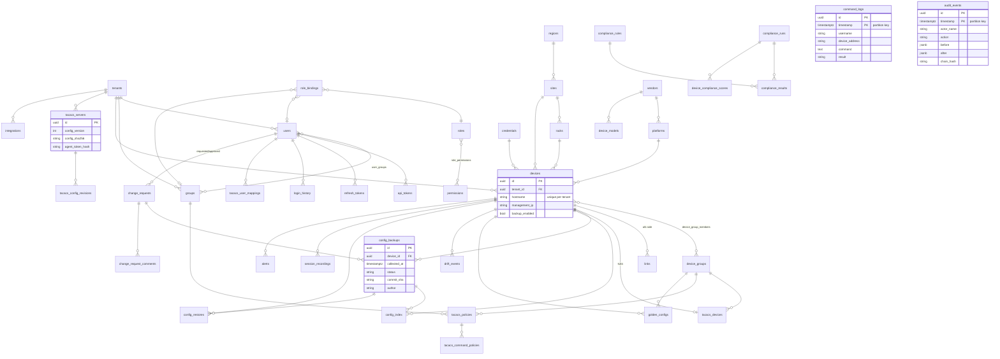

# Database

PostgreSQL 16 is the system of record (configuration *content* lives in per-tenant Git
repositories, see [backup-architecture.md](backup-architecture.md)). The schema is defined by
SQLAlchemy models in `backend/app/models/*.py` and created by Alembic:

| Revision | Content |
|---|---|
| `0001_initial_schema` | all tables, indexes, constraints; `command_logs`, `audit_events`, `tacacs_auth_events` created `PARTITION BY RANGE (timestamp)` |
| `0002_partitioning` | `nom_ensure_partitions()`, `nom_drop_old_partitions()`, append-only trigger on `audit_events`, `pg_trgm` extension + trigram index on `command_logs.command`, `jsonb_path_ops` GIN index on `config_index.attributes` |

```bash
cd backend && alembic upgrade head      # or: docker compose run --rm migrate / the nom-migrate Job
alembic check                           # CI: models and migrations are in sync
```

Conventions (`app/db/base.py`): UUID primary keys (`uuid4`), `timestamptz` everywhere, JSON
columns are `JSONB` on PostgreSQL, constraint/index names follow a fixed naming convention, and
every tenant-owned table carries `tenant_id → tenants.id ON DELETE CASCADE` with an index.

## Schema by module

### Identity, RBAC, tenancy (Modules 1, 19) - `models/identity.py`

| Table | Purpose / notable columns |
|---|---|
| `tenants` | `name`, `slug` (unique), `is_active`, `settings` JSONB (e.g. `restore_requires_change`) |
| `users` | unique `(tenant_id, username)`; `password_hash` (Argon2), `password_history`, `auth_source` local/ldap/ad/oidc, `external_id`, `is_superuser`, `mfa_enabled`, `mfa_secret_enc` (Fernet), `failed_logins`, `locked_until` |
| `groups`, `user_groups` | local or directory/IdP-sourced groups (`source`, `external_dn`) |
| `permissions` | global permission catalogue (`code`, e.g. `tacacs:deploy`) |
| `roles`, `role_permissions` | built-in (global, `tenant_id NULL`) and tenant roles |
| `role_bindings` | role → user or group, optional `scope_type`/`scope_id` (site / device group) and ABAC `conditions` (`vendor`, `hours`) |
| `login_history` | every login attempt (method, IP, user agent, reason) |
| `refresh_tokens` | SHA-256 of the token, `family_id` (rotation family), `revoked_at`, `replaced_by` |
| `api_tokens` | SHA-256 of the token, `token_prefix`, `scopes`, `expires_at`, `revoked` |

### Inventory, groups, topology (Modules 3, 12, 13) - `models/inventory.py`

| Table | Purpose / notable columns |
|---|---|
| `regions`, `sites`, `racks` | location hierarchy; `netbox_id` for synced objects |
| `vendors`, `platforms`, `device_models` | global catalogue; platform = collection recipe (`scrapli_platform`, `netmiko_device_type`, `backup_commands`), `tacacs_service`, `supports_tacacs`, `supports_config_replace` |
| `credentials` | device login (`password_enc`, `ssh_key_enc`, `enable_secret_enc` - Fernet) |
| `devices` | unique `(tenant_id, hostname)`; `management_ip`, platform/vendor/site/credential, `status`, `reachability`, `backup_enabled`, `ssh_port`, `tags`, `custom_fields`, `last_backup_*` |
| `device_groups`, `device_group_members` | static or dynamic (`dynamic_filter`) groups, nesting via `parent_id` |
| `links` | topology (from NetBox cables) |

### TACACS+ (Module 2) - `models/tacacs.py`

| Table | Purpose / notable columns |
|---|---|
| `tacacs_servers` | tac_plus-ng instances; `config_version`, `config_sha256` (deployed), `last_deployed_at`, `last_heartbeat_at`, `agent_token_hash` |
| `tacacs_devices` | NAS clients: `address` (IP/CIDR), `key_enc` (Fernet), `vendor`, link to device or device group, `key_rotated_at` |
| `tacacs_policies`, `tacacs_command_policies` | group (+ device group) → privilege level, Junos class, FortiGate profile, Arista role, extra attributes, time window, ordered permit/deny command regexes |
| `tacacs_user_mappings` | platform user → TACACS username, `auth_method` crypt/ldap, `password_crypt`, `valid_until` |
| `tacacs_config_revisions` | every deploy: version, sha256, rendered content **with keys redacted** |

### Configuration management (Modules 4, 5, 6, 11) - `models/configs.py`

| Table | Purpose / notable columns |
|---|---|
| `config_backups` | one row per collection: `status` success/unchanged/failed, `changed`, `commit_sha`, `content_sha256`, +/- lines, `author` (TACACS correlation), `reason`, `trigger`, `change_request_id`, `risk_score`, `duration_ms` |
| `config_index` | parsed objects for config intelligence search (`kind`, `key`, `attributes` JSONB) |
| `golden_configs`, `drift_events` | golden snippets/full configs per device or group; detected drift |
| `compliance_rules`, `compliance_runs`, `compliance_results`, `device_compliance_scores` | rule catalogue, runs (tenant score), per-rule results, per-device score |
| `config_restores` | dry-run/push history with device-computed diff and pre-restore backup |

### Activity (Modules 7, 8, 9, 10) - `models/activity.py`

| Table | Purpose / notable columns |
|---|---|
| `command_logs` **(partitioned)** | TACACS accounting + denied authorizations; PK `(id, timestamp)`; `device_id` is a soft reference (no FK - partitions avoid FK fan-in) |
| `tacacs_auth_events` **(partitioned)** | authentication / authorization results |
| `session_recordings` | asciicast metadata, `storage_uri` (`file://...`), `sha256`, extracted `commands` |
| `audit_events` **(partitioned, append-only)** | actor, action, target, before/after (secrets redacted), `outcome`, `chain_hash` |
| `change_requests`, `change_request_comments` | workflow state, per-tenant `number`, device ids, pre/post backup ids |

### Operations (Modules 14-18) - `models/ops.py`

| Table | Purpose / notable columns |
|---|---|
| `integrations` | NetBox / IXP Manager / birdseye connection (`base_url`, `token_enc`, `options`, last sync status) |
| `external_objects` | mirrored NetBox objects (VLANs, prefixes, IPs, VRFs, ASNs, contacts) |
| `ixp_members`, `route_server_clients` | IX-F member data; route-server sessions with accepted/filtered/exported prefixes, IRR/RPKI status |
| `alert_channels`, `alert_rules`, `alerts` | delivery targets (`target_enc`), routing rules with throttling, raised alerts (dedup key, acknowledgement) |
| `report_schedules` | scheduled CSV/XLSX/PDF reports by email |

## Entity-relationship diagram

Main relationships (tenant FK omitted on most tables for readability - every table except the
global catalogue has one).



## Indexes

Besides primary keys, unique constraints and the `tenant_id` index on every tenant table:

| Index | Serves |
|---|---|
| `ix_command_logs_user_ts (username, timestamp)`, `ix_command_logs_device_ts (device_address, timestamp)`, `ix_command_logs_session_id` | accounting search by user / device, author correlation for backups |
| `ix_command_logs_command_trgm` GIN `gin_trgm_ops` (0002) | `ILIKE '%...%'` command substring search |
| `ix_tacacs_auth_events_ts`, `..._username` | auth event listing |
| `ix_audit_events_actor_ts`, `ix_audit_events_target (target_type, target_id)`, `..._action` | audit filters |
| `ix_config_backups_device_time (device_id, collected_at)`, `..._collected_at`, `..._commit_sha` | backup history, last backup per device |
| `ix_config_index_kind_key (tenant_id, kind, key)`, `ix_config_index_device`, `ix_config_index_attrs` GIN `jsonb_path_ops` (0002) | config intelligence search |
| `ix_compliance_results_run_device (run_id, device_id)` | run detail |
| `devices`: `hostname`, `management_ip`, `serial`, `site_id`, `platform_id`, `netbox_id` | inventory filters, ingest correlation |
| `alerts`: `created_at`, `event_type`, `dedup_key` | alert throttling / listing |

Indexes declared on a partitioned parent are created on every partition automatically.
`alembic/env.py` excludes the monthly partitions and the two hand-written 0002 indexes from
autogenerate, so `alembic check` stays clean.

## Monthly range partitioning

`command_logs`, `audit_events` and `tacacs_auth_events` are `PARTITION BY RANGE (timestamp)`.
Partitions are named `<table>_yYYYYmMM`, plus a `<table>_default` catch-all.

```sql
-- create partitions from last month up to N months ahead (+ the default partition); idempotent
SELECT nom_ensure_partitions('command_logs', 3);
-- drop whole monthly partitions whose upper bound is older than the retention
SELECT nom_drop_old_partitions('command_logs', 365);
```

* Migration 0002 runs `nom_ensure_partitions(t, 3)` for the three tables.
* Celery beat runs `ensure_partitions` daily at 00:10 UTC (3 months ahead) and `apply_retention`
  daily at 03:15 UTC.
* Retention by partition drop is O(1) and does not bloat the table or WAL like a bulk `DELETE`.
* Rows that land in `<table>_default` (timestamps outside the created range, e.g. devices with
  a wrong clock) are never dropped by `nom_drop_old_partitions` (it only matches `_yYYYYmMM`).
  **(recommendation)** Monitor `SELECT count(*) FROM command_logs_default` and fix device NTP.
* `nom_drop_old_partitions` sets `nom.allow_audit_purge=on` for its transaction so it can drop
  `audit_events` partitions despite the append-only guard (a `DROP TABLE` does not fire row
  triggers anyway; the setting matters for row deletes).

## Retention settings

| Setting | Default | Applies to | Mechanism |
|---|---|---|---|
| `NOM_RETENTION_COMMAND_LOGS_DAYS` | 365 | `command_logs` **and** `tacacs_auth_events` | partition drop (PostgreSQL) |
| `NOM_RETENTION_AUDIT_DAYS` | 730 | `audit_events` | partition drop |
| `NOM_RETENTION_LOGIN_HISTORY_DAYS` | 365 | `login_history` | row `DELETE` |
| `NOM_RETENTION_SESSION_RECORDINGS_DAYS` | 180 | `session_recordings` + `.cast` files | row `DELETE`; `file://` recordings are unlinked (object-storage recordings: add a bucket lifecycle rule) |
| `NOM_RETENTION_BACKUP_ROWS_DAYS` | 90 | `config_backups` with status `unchanged`/`failed` | row `DELETE`; rows that recorded a change, are linked to a change request or referenced by a restore are kept (Git history is never rewritten) |
| `NOM_RETENTION_ALERTS_DAYS` | 180 | `alerts` | row `DELETE` |

Granularity is a month: a partition is dropped when its *upper bound* is older than the
retention, so up to one extra month is kept. `compliance_*` and `drift_events` have no automatic
retention (see sizing notes in
[architecture.md](architecture.md#53-postgresql-sizing-partitioned-log-tables)).

## Audit trail: append-only trigger and hash chain

Two independent protections (Module 9):

1. **Append-only trigger** (migration 0002):

   ```sql
   CREATE TRIGGER audit_events_append_only BEFORE UPDATE OR DELETE ON audit_events
       FOR EACH ROW EXECUTE FUNCTION nom_audit_append_only();
   ```

   `nom_audit_append_only()` raises `audit_events is append-only` unless the session variable
   `nom.allow_audit_purge` is `on` (set only inside `nom_drop_old_partitions`). A compromised
   application role therefore cannot silently rewrite history with `UPDATE`/`DELETE`.

2. **Per-tenant hash chain** (`app/services/audit.py`): each event stores
   `chain_hash = sha256(previous_chain_hash + canonical_json(event))`, where the canonical JSON
   covers timestamp, actor, action, target, before, after and outcome. Writers take the previous
   hash with `SELECT ... FOR UPDATE` and keep timestamps strictly increasing so the order is
   unambiguous. `GET /api/v1/audit/verify` recomputes the chain and returns
   `{"intact": bool, "events_verified": n}`; any modified, inserted or deleted row breaks it from
   that point on.

Secrets are redacted in `before`/`after` (`password`, `key`, `token`, `*_enc`, ... →
`"***"`). Limits:

* the trigger does not stop a PostgreSQL superuser (who can disable triggers);
* retention legitimately drops the oldest partitions, but `verify_chain` always starts from an
  empty hash - once the first `audit_events` partition has been dropped (after
  `NOM_RETENTION_AUDIT_DAYS`, default 730 days) `/audit/verify` reports `intact: false` at the
  first remaining event. This is a known limitation of the current code; **(recommendation)**
  record the last `chain_hash` of each month before it expires and verify from that anchor.

**(recommendation)** Run the application with a non-superuser role, ship
audit events to an external SIEM/WORM store, and periodically record the latest `chain_hash`
outside the database (e.g. in the change ticket system) so a full-chain rewrite is detectable.

## Operational queries

```sql
-- partition sizes
SELECT inhrelid::regclass AS partition, pg_size_pretty(pg_total_relation_size(inhrelid))
FROM pg_inherits WHERE inhparent = 'command_logs'::regclass ORDER BY 1;

-- rows that fell into the default partitions
SELECT 'command_logs' t, count(*) FROM command_logs_default
UNION ALL SELECT 'tacacs_auth_events', count(*) FROM tacacs_auth_events_default
UNION ALL SELECT 'audit_events', count(*) FROM audit_events_default;

-- backups per status in the last day
SELECT status, count(*) FROM config_backups WHERE collected_at > now() - interval '1 day' GROUP BY 1;
```
