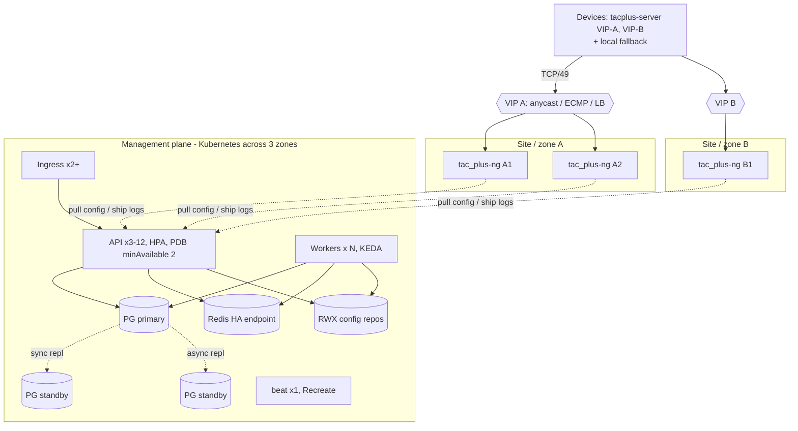

# High availability

Goal: no single failure (node, zone, database primary, TACACS instance) stops network engineers
from logging in to devices, and the management plane recovers without data loss. The AAA path
(devices → tac_plus-ng) is deliberately decoupled from the management plane (API, database):
tac_plus-ng keeps authenticating with its last deployed configuration even if everything else is
down.

## Component matrix

| Component | Redundancy | Failure impact | Recovery |
|---|---|---|---|
| **tac_plus-ng** | 2+ per site (and per tenant), anti-affinity across nodes/zones | none if devices list ≥ 2 servers or a VIP has another healthy backend | automatic (LB health / device failover) |
| **API** | N stateless replicas, PDB `minAvailable: 2`, HPA 3–12 | none | Kubernetes reschedules |
| **Frontend** | 2–3 replicas | none | automatic |
| **Workers** | N replicas (KEDA 2–20) | backups delayed; tasks re-delivered (`acks_late`) | automatic |
| **Beat** | exactly 1 (`Recreate`) | no *new* scheduled jobs until rescheduled (seconds–minutes) | Kubernetes reschedules; missed ticks are not replayed |
| **PostgreSQL** | CloudNativePG 3 instances, 1 synchronous standby | writes pause ~10–30 s during failover | automatic promotion |
| **Redis** | managed service with automatic failover behind one endpoint | queued tasks may be lost on failover; API rate limiter falls back to per-process memory | automatic |
| **RWX storage** | provider-replicated (EFS/Filestore/CephFS) | backups and diffs fail while unavailable | provider |
| **Ingress / proxy** | 2+ controller replicas | none | automatic |

## TACACS+ (the critical path)

**Run at least two tac_plus-ng instances per site and per tenant.** Each rendered configuration
contains one tenant's NAS clients, users and policies, so tenants do not share instances.

Two complementary patterns:

1. **Multiple servers configured on the device** (simplest, works everywhere). List two or three
   server addresses; devices try them in order and fall back to local only if all are
   unreachable. Use different instances/sites for each address. Timeouts matter: keep per-server
   timeouts low (2–5 s) so a dead first server does not stall logins.
2. **VIP with anycast / ECMP / load balancer** in front of a pool. On Kubernetes: the `nom-tacacs`
   Service (`type: LoadBalancer`, `externalTrafficPolicy: Local` - mandatory, the NAS is identified
   by source IP) with MetalLB in BGP mode or a cloud NLB; outside Kubernetes: announce the same /32
   from each TACACS host with BIRD/FRR (health-checked by `nom-tacacs-agent healthcheck`) and let
   the routers ECMP. TACACS+ uses one TCP connection per session (single-connection mode is not
   rendered), so per-flow hashing is safe.

Combine both for the best result: `VIP-A` (site A pool) and `VIP-B` (site B pool) configured on
every device.

Why this is safe with a central API: the agent keeps the last good configuration on its own
volume (StatefulSet PVC / host disk). During an API or database outage tac_plus-ng continues to
authenticate, authorize and log; accounting lines stay in the log files and are shipped from the
persisted offsets once the API returns (at-least-once). Configuration changes simply wait.

All instances of a pool receive the same revision: each replica has its own TACACS server object
and token (`nom-tacacs-0`, `-1`, ...); deploy to each (the render is identical, so the ETag is too)
and watch `last_heartbeat_at` per server.

## API

* Stateless: JWT access tokens, refresh/API tokens in PostgreSQL, rate-limit counters in Redis.
  Scale with replicas (`NOM_API_WORKERS=1` per container so Prometheus counters stay coherent).
* Probes: `/healthz` (process alive) for liveness, `/readyz` for readiness. `/readyz` returns 503
  only when PostgreSQL is unreachable (pods leave the load balancer); a Redis outage returns 200
  with `"degraded": true` and `checks.redis: "down"` - the API keeps serving (rate limits and OIDC
  state fall back to per-process memory, async jobs cannot be queued), because taking every replica
  out of rotation for a Redis blip would turn a partial outage into a full one. Body:
  `{"status": "ready", "degraded": false, "checks": {"database": "ok", "redis": "ok"}}`.
* `preStop` sleep + `maxUnavailable: 0` rolling updates avoid dropped requests during deploys.
* OIDC: the pending authorisation (`state` → PKCE verifier + tenant) is stored in Redis
  (`nom:oidc:state:<state>`, `SET EX 600`, consumed with `GETDEL` so a state is single-use), so the
  callback may land on any replica - no session affinity is needed. Only while Redis is
  unreachable does the API fall back to a per-process TTL dict (then a login started on one replica
  must finish on the same one; it simply fails with "unknown or expired state" otherwise).
* Synchronous operations (`POST /backups/run` with `run_async=false`, drift-check, restore) run
  inside the API request; keep them for single devices and use the async path for bulk work.

## PostgreSQL

### CloudNativePG (Kubernetes) - reference

`deploy/k8s/components/cloudnative-pg/cluster.yaml`: 3 instances with required zone
anti-affinity, `minSyncReplicas/maxSyncReplicas: 1` (a commit is acknowledged by one standby →
RPO 0 for a single failure), WAL on a separate volume, continuous WAL archiving and nightly base
backups to S3 with barman (PITR), pg_stat_statements, PodMonitor. Applications connect to the
`nom-db-rw` service, which always points at the primary; failover is automatic
(typically < 30 s). The app reconnects transparently (`pool_pre_ping=True`); in-flight requests
fail with 500 and are retried by clients (the SDKs retry idempotent calls).

For large installations add a CloudNativePG `Pooler` (PgBouncer) and point `NOM_DATABASE_URL` at
it (PgBouncer ≥ 1.21 with `max_prepared_statements` > 0 when using transaction pooling, because
psycopg 3 uses prepared statements).

### Patroni / managed services (VMs, cloud)

* **Patroni** (etcd/Consul DCS) with 3 nodes, `synchronous_mode: true`, HAProxy or a VIP
  (vip-manager) exposing the leader on 5432; pgBackRest or WAL-G for archiving.
* **Managed** (RDS/Aurora, Cloud SQL, Azure Flexible Server): Multi-AZ/HA option, automated
  backups with PITR, `pg_trgm` allow-listed. Use the writer endpoint.

In all cases: `sslmode=require`, `max_connections` sized for API pods × 40 (SQLAlchemy pool) +
workers, and the partition/retention jobs keep table sizes bounded.

## Redis

All Redis clients are built in one place (`app/core/redis.py`): the API rate limiter, the OIDC
state store and the Celery broker/result backend. Two modes:

* **Plain** - `NOM_REDIS_URL=redis://:pw@redis:6379/0` (or `rediss://`). Use with a managed Redis
  that has automatic failover behind a stable endpoint (ElastiCache Multi-AZ, Memorystore
  Standard, Azure Cache Standard/Premium) or a master-tracking proxy.
* **Sentinel (native)** - set `NOM_REDIS_SENTINELS=sen1:26379,sen2:26379,sen3:26379` and
  `NOM_REDIS_SENTINEL_MASTER=mymaster` (plus `NOM_REDIS_SENTINEL_PASSWORD` if the sentinels
  require AUTH). The password and db number still come from `NOM_REDIS_URL` (its host/port are
  ignored). The API uses `redis.sentinel.Sentinel(...).master_for(master)` and follows failovers;
  Celery gets `broker_url = result_backend = sentinel://:pw@sen1:26379/0;sentinel://...` with
  `broker_transport_options` / `result_backend_transport_options` =
  `{"master_name": ..., "sentinel_kwargs": {"password": ...}}`. Typical deployment: 3 sentinels,
  1 primary, 1-2 replicas (Bitnami chart with `sentinel.enabled=true`, or the OT-CONTAINER-KIT
  redis-operator).

While Redis is unreachable the API does not wait on it for every request: after an error the rate
limiter and OIDC store skip Redis for 30 s (circuit breaker) and use per-process memory.

What a Redis failover costs: tasks queued but not yet started may be lost with asynchronous
replication (the next hourly schedule re-collects; manual backup requests may need resubmitting);
rate-limit windows reset. No platform data lives only in Redis.

## Workers and beat

* Workers are horizontally scalable and stateless apart from the shared RWX volume.
  `task_acks_late=True` + `worker_prefetch_multiplier=1`: a task is acknowledged after it
  finishes, so a crashed worker's task is re-delivered (Redis visibility timeout, default 1 h).
  `terminationGracePeriodSeconds: 900` lets a scaled-down pod finish its chunk.
* KEDA scales on the `collect` list length (`components/keda`); minimum 2 replicas across zones.
* Beat has no leader election: never run two. The Deployment uses `replicas: 1` +
  `strategy: Recreate`; the schedule state is in `/tmp` (recreated on restart - the next tick is
  simply computed again). A missed tick during a beat outage is not replayed; the hourly backup
  catches up on the next run.

## Configuration repositories (RWX storage)

The per-tenant Git repositories must be visible to the API and all collect workers at the same
path.

* **RWX volume** (default): NFS/CephFS/EFS/Filestore/Azure Files with provider-side replication
  and snapshots. Git's small-file I/O is fine on these for this workload.
* **Per-tenant Git remotes (recommendation)**: in addition, mirror every tenant repository to an
  external Git server (`deploy/k8s/extras/git-mirror-cronjob.yaml` runs `git push --mirror`
  every 15 minutes). This gives an off-site copy and lets teams consume configs with normal Git
  tooling; it is not a replacement for the shared volume (the platform only reads/writes the local
  repositories).
* Mount options: prefer `hard` NFS mounts; avoid aggressive attribute caching (`actimeo=0` is not
  needed, but `lookupcache=positive` helps) so that a commit by one worker is immediately visible to
  the API.

## Testing HA

Regularly (see the DR drill in [disaster-recovery.md](disaster-recovery.md#dr-drill-checklist)):

* delete one tac_plus-ng pod / stop one host: device logins must succeed via the other server;
* `kubectl cnpg promote` or delete the primary pod: API recovers within ~30 s;
* drain a node hosting API and workers: no failed requests beyond retries;
* scale workers to zero during a backup run, scale back: chunks are re-delivered.
