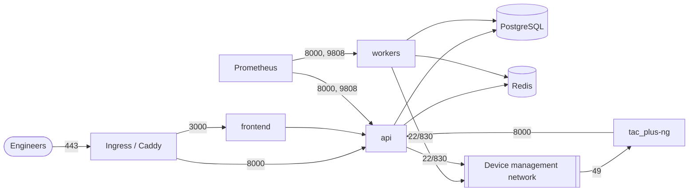

# Security hardening

NetworkOps Manager holds the keys to the network: device credentials, TACACS+ shared secrets,
the authorization policy for every engineer, and the configuration of every device. This guide
describes the security controls implemented in the code and how to deploy and operate them.
Items marked **(recommendation)** are operational guidance, not code features.

## 1. Authorization: RBAC + ABAC

Effective permissions = union of the roles bound to the user directly or through their groups
(`services/rbac.py`). Handlers declare what they need with `require("<permission>")`.

Permission catalogue: `users:read`, `users:write`, `tenants:admin`, `devices:read`,
`devices:write`, `credentials:write`, `tacacs:read`, `tacacs:write`, `tacacs:deploy`,
`configs:read`, `configs:backup`, `configs:restore`, `configs:delete`, `compliance:read`,
`compliance:write`, `accounting:read`, `sessions:read`, `audit:read`, `changes:read`,
`changes:write`, `changes:approve`, `integrations:write`, `alerts:write`, `reports:read`.

Built-in roles (global, seeded by `app.cli init`):

| Role | Permissions |
|---|---|
| `admin` | everything except `tenants:admin` |
| `network-engineer` | devices r/w, tacacs read, configs read/backup/restore, compliance read, accounting, sessions, changes read/write, reports |
| `change-manager` | devices/configs read, changes read/write/**approve**, audit read, reports |
| `noc` | devices, configs, compliance, accounting read, changes read |
| `auditor` | read-only across devices, configs, compliance, accounting, sessions, audit, changes, tacacs, users, reports |
| `read-only` | devices, configs, compliance, changes read |

ABAC on a role binding:

* **Scope** - `scope_type: site | device_group` + `scope_id`: the permission applies only to
  devices in that site/group. Device lists, backups, diffs, config search and restores are
  filtered accordingly (a device outside the scope returns 404).
* **Conditions** - `{"vendor": ["juniper","arista"]}` (only these vendors) and
  `{"hours": "07:00-19:00"}` (time window; evaluated in the API server's local time zone - run
  containers in UTC and express windows in UTC).

Anti-escalation: a user cannot create a role or a role binding containing permissions they do not
hold themselves (superusers excepted), and cannot create an API token with scopes they do not hold.
Change approval enforces the **four-eyes principle** (the requester cannot approve).

Platform superusers (`is_superuser`, created with `init --superuser`) hold every permission and may
act in any tenant via `X-Tenant`. **(recommendation)** Keep them to a handful of named, MFA-enabled
accounts, never use them for daily work, and alert on `X-Tenant` usage in the audit trail.

## 2. Authentication

| Control | Implementation | Setting |
|---|---|---|
| Password hashing | Argon2id (`argon2-cffi`) | - |
| Password policy | min length, ≥ N character classes, must not contain the username | `NOM_PASSWORD_MIN_LENGTH=12`, `NOM_PASSWORD_REQUIRE_CLASSES=3` |
| Password history | last N hashes cannot be reused | `NOM_PASSWORD_HISTORY=5` |
| Lockout | account locked for M minutes after N failed password attempts (bad OTPs also increment the counter) | `NOM_MAX_FAILED_LOGINS=5`, `NOM_LOCKOUT_MINUTES=15` |
| MFA | TOTP (RFC 6238, ±1 step), enrolled via `/auth/mfa/setup` + `/auth/mfa/verify`; secret Fernet-encrypted | - |
| Directory / SSO | LDAP/AD bind (JIT provisioning, group sync), OIDC code flow + PKCE | `NOM_LDAP_*`, `NOM_OIDC_*` |
| Login history | every attempt with IP, user agent, method, reason | retention `NOM_RETENTION_LOGIN_HISTORY_DAYS` |

**(recommendation)** Enforce MFA for local accounts of admins and approvers; for SSO users enforce
MFA at the identity provider. Prefer SSO/LDAP for humans and keep local accounts for break-glass
only.

### Tokens

* **Access tokens**: JWT HS256 signed with `NOM_JWT_SECRET` (≥ 32 chars), `typ=access`, `jti`,
  lifetime `NOM_ACCESS_TOKEN_TTL_MINUTES` (15). Stateless: they stay valid until expiry, which is
  why the lifetime is short.
* **Refresh tokens**: opaque (`nomr_...`), only the SHA-256 is stored, lifetime
  `NOM_REFRESH_TOKEN_TTL_DAYS` (14). **Rotation on every use**: `/auth/refresh` issues a new pair
  and revokes the old token (`replaced_by`). **Reuse detection**: presenting an already-rotated
  token revokes the whole token *family* (all sessions derived from that login) and returns
  `token_reuse` - a stolen refresh token can be used at most once, and its use logs out the victim
  and the attacker. `/auth/logout` revokes the family.
* **API tokens** for automation: opaque `nomt_...`, SHA-256 stored, visible prefix for
  identification, optional expiry, `last_used_at`, revocable. **Scopes** restrict a token to a
  subset of its owner's permissions (`{"scopes":["devices:read","configs:backup"]}`); the token also
  loses permissions its owner loses.
* **Agent tokens** (`nomagent_...`, per TACACS server, SHA-256 stored): accepted only by the agent
  endpoints (`/tacacs/agent/*`, `/accounting/ingest`, `POST /sessions`) and scoped to one tenant.
  Rotate by recreating the server object **(recommendation: add a rotate endpoint)**.

Rotate `NOM_JWT_SECRET` by changing it and restarting the API: all access tokens become invalid
immediately; clients refresh (refresh tokens are not JWTs and stay valid).

## 3. Rate limiting and HTTP hardening

* Fixed-window limiter per client IP backed by Redis (plain or Sentinel, `app/core/redis.py`;
  per-process fallback with a 30 s circuit breaker while Redis is down):
  `/auth/login`, `/auth/refresh`, `/auth/mfa/verify` → `NOM_RATE_LIMIT_LOGIN` (10) per
  `NOM_RATE_LIMIT_WINDOW_SECONDS` (60); every other `/api/v1` call → `NOM_RATE_LIMIT_API` (600).
  429 responses carry `Retry-After`; successful ones `X-RateLimit-Limit/Remaining`.
* The client IP is the **first** `X-Forwarded-For` entry. The API must therefore only be
  reachable through a proxy that overwrites/sanitises `X-Forwarded-For` (Caddy with
  `trusted_proxies`, ingress-nginx with `use-forwarded-headers: false` - both defaults in this
  repository). Never expose port 8000 directly, or clients can spoof their rate-limit key.
* Response headers on every API response: `X-Content-Type-Options: nosniff`,
  `X-Frame-Options: DENY`, `Referrer-Policy: no-referrer`, `X-Request-ID`, and HSTS when
  `NOM_ENVIRONMENT=production`. CORS allows only `NOM_CORS_ORIGINS`.
* Unhandled exceptions return a generic 500 (details only in server logs).
* Cross-tenant object access returns 404 (no existence oracle).

## 4. Secret encryption and key rotation

Device passwords / SSH keys / enable secrets, TACACS NAS keys, integration tokens, alert channel
targets (webhook URLs) and MFA seeds are encrypted with **Fernet** (AES-128-CBC + HMAC-SHA256)
through `MultiFernet` using `NOM_ENCRYPTION_KEYS` - a comma separated list, **newest first**.
Decryption tries every key; encryption uses the first. With `NOM_ENVIRONMENT=production` and no
keys, every encrypt/decrypt raises an error (outside production a key derived from the JWT secret
is used - never rely on that).

Rotation procedure (`app/cli.py rotate-secrets`):

```bash
# 1. new key
docker compose run --rm --no-deps api cli genkey                     # or: python -m app.cli genkey
# 2. prepend it everywhere (API, workers, beat) and roll out
NOM_ENCRYPTION_KEYS=<new>,<old>
# 3. re-encrypt every secret with the newest key (credentials, tacacs_devices, integrations,
#    alert_channels, users.mfa_secret_enc) - one-off job/container
docker compose run --rm api cli rotate-secrets     # k8s: kubectl -n networkops run ... -- cli rotate-secrets
#    -> "re-encrypted N secrets; the old key can now be removed"
# 4. remove the old key, roll out again; destroy the old key after the backup retention window
NOM_ENCRYPTION_KEYS=<new>
```

Keep old keys available to restore database backups taken before the rotation (escrow them with
the backup for the PITR window). **(recommendation)** Rotate annually and after any suspected
exposure; store keys only in the secret manager.

### TACACS+ shared keys

Each NAS entry gets its own random key (`secrets.token_urlsafe(24)`) unless you set one.
`POST /tacacs/devices/{id}/rotate-key` generates a new key and returns it **once**; configure it
on the device, then deploy the TACACS configuration. To rotate without an outage use a short
window: deploy right after changing the device, or (**recommendation**) automate device-side
change + deploy in one change request. Rendered configurations stored as revisions and shown in
the UI have keys **redacted**; only the agent receives the clear-text config over its
authenticated channel, and writes it with mode 0640.

TACACS user passwords are stored as SHA-512 crypt (656,000 rounds) and rendered as
`password login = crypt ...`; they never appear in clear text in the database. They are set on
create or with `PATCH /tacacs/users/{id}` (`password`, checked against the password policy;
`clear_password`; `enabled`; `valid_until`; `auth_method`), audited as `tacacs.user.update` with
only a `password_changed` flag - never the value.

### Secrets in configuration backups

`NOM_BACKUP_SANITIZE_SECRETS=true` (default) masks passwords, keys and communities before configs
are committed to the Git repositories. A tenant can override it with the tenant setting
`backup_sanitize_secrets` (`PATCH /api/v1/tenants/{id}`, `tenants:admin`, audited) - needed for
byte-exact restores, because the restore API refuses backups with masked secrets. With sanitising
off, the repositories contain device secrets in their on-box form (IOS type 7 and Junos `$9$` are
reversible). Then:

* encrypt the repository volume at rest (encrypted StorageClass / LUKS / KMS-backed EFS/Filestore)
  **and** every copy of it: Git mirrors (`git-mirror-cronjob` target must be a private, encrypted
  remote), volume snapshots, DR replicas;
* do not export the volume beyond the API/worker pods; treat `configs:read` on that tenant as
  access to device secrets and grant it accordingly;
* prefer per-tenant decisions: keep sanitising on for tenants that do not restore through the
  platform.

The platform does not add its own encryption layer on top of Git (diffs, search and compliance
need the plain text); protection is at the storage layer.

### OIDC login state

The OIDC `state`/PKCE verifier lives in Redis for 10 minutes and is deleted on first use
(`GETDEL`), so replayed or forged callbacks fail with 400. First-time SSO users are provisioned
(`auth_source=oidc`, matched by `sub`); a first login whose username already belongs to a local or
LDAP account is refused (409) instead of silently taking the account over, and disabled SSO users
are refused (401).

## 5. Audit trail

Every state-changing action is recorded in `audit_events` (actor, source IP, action, target,
redacted before/after, outcome). Tamper evidence: a per-tenant SHA-256 **hash chain**
(`GET /audit/verify`) and an **append-only trigger** that rejects `UPDATE`/`DELETE` except for the
partition-retention function. Details and limits: [database.md](database.md#audit-trail-append-only-trigger-and-hash-chain).
Session replays are audited (`session.replay`).

**(recommendation)** Forward audit events to a SIEM, keep the application's DB role
non-superuser, and store periodic chain anchors outside the database.

## 6. Transport security

* HTTPS only at the edge (Caddy / cert-manager), HSTS, TLS 1.2+.
* `sslmode=require`/`verify-full` for PostgreSQL, `rediss://` for managed Redis.
* LDAPS (`ldaps://`), HTTPS for OIDC, NetBox, IXP Manager, birdseye, webhooks
  (NetBox `options.verify_tls` defaults to true - do not disable in production).
* SSH to devices (collector): host keys are not pinned (`auth_strict_key: False`) - compensate
  with network segmentation (below).
* TACACS+ is obfuscated with the per-device key, not encrypted with TLS: keep it inside the
  management network.

## 7. Network segmentation



* Kubernetes: `deploy/k8s/base/networkpolicies.yaml` - default deny for ingress **and** egress;
  DNS allowed; ingress-controller → frontend/api; frontend/tacacs/monitoring → api; only
  api/worker/beat (label `networkops.io/datastore-client`) and the migrate Job → datastores
  (label `networkops.io/datastore`); datastores accept only those; api/worker → SSH/NETCONF,
  HTTPS, LDAP(S), SMTP outbound; devices → tacacs:49; tacacs → api and LDAP.
  **Narrow the `0.0.0.0/0` ipBlocks to your management and service networks.**
* TACACS VIP: `loadBalancerSourceRanges` limited to management networks; firewall TCP/49 from
  device loopbacks/management only.
* Compose: datastores only on the `backend` network; the proxy only on `frontend`; Prometheus and
  Grafana bound to 127.0.0.1.
* **(recommendation)** Place collectors in (or with a route to) the out-of-band network only; do
  not give them Internet egress beyond the integration endpoints.

## 8. Container and runtime hardening

| Control | Backend | Frontend | TACACS |
|---|---|---|---|
| Non-root user | uid 10001 | uid 1001 (must match its Dockerfile) | uid 10002 |
| Read-only root filesystem | yes (`/tmp` emptyDir/tmpfs) | yes (`/tmp`, `.next/cache`) | yes (`/run/nom`, `/tmp`, data volume) |
| `allowPrivilegeEscalation: false` / `no-new-privileges` | yes | yes | yes |
| Capabilities | drop ALL | drop ALL | drop ALL (port 49 via sysctl `ip_unprivileged_port_start=0`) |
| Seccomp | RuntimeDefault | RuntimeDefault | RuntimeDefault |
| Service-account token | not mounted | not mounted | not mounted |
| Pod Security Standard | namespace enforces `restricted` | | |
| Init | tini | (image) | tini + supervisor |

Images are multi-stage (no compilers in runtime images), built with SBOM and provenance and
attested in the release workflow. CI runs CodeQL (Python, JavaScript/TypeScript), pip-audit,
npm audit, Trivy (images + IaC) and gitleaks (`.github/workflows/security.yml`).
**(recommendation)** Pin images by digest in production and verify attestations
(`gh attestation verify`) or with a Kyverno/Connaisseur admission policy.

## 9. Hardening checklist (CIS style)

Identity and access

- [ ] `NOM_ENVIRONMENT=production`; strong unique `NOM_JWT_SECRET` (≥ 48 random bytes); `NOM_ENCRYPTION_KEYS` set and escrowed.
- [ ] Bootstrap admin replaced by named accounts; MFA enabled for every local admin/approver.
- [ ] SSO (OIDC) or LDAP/AD for humans; directory groups mapped to roles; no direct user role bindings except break-glass.
- [ ] Superusers ≤ 3, MFA, not used for daily work.
- [ ] Least privilege: engineers scoped to their sites/device groups; `configs:restore`, `tacacs:deploy`, `changes:approve` held by few.
- [ ] API tokens scoped and expiring; reviewed quarterly (`GET /auth/tokens` per user, `last_used_at`).
- [ ] Password policy ≥ defaults; lockout enabled; `NOM_RATE_LIMIT_LOGIN` ≤ 10/min.

Secrets and data

- [ ] Secrets only in the secret manager (External Secrets); nothing in Git (gitleaks green).
- [ ] Fernet key rotation performed at least yearly (`rotate-secrets`); old keys destroyed after the backup window.
- [ ] TACACS NAS keys unique per device and rotated on staff changes (`rotate-key`).
- [ ] `NOM_BACKUP_SANITIZE_SECRETS=true` unless full-fidelity restores are required and the repos are access-controlled.
- [ ] Database role used by the app is not superuser; backups encrypted at rest; S3 Object Lock.

Network

- [ ] API reachable only through the proxy/ingress; port 8000 not exposed; `/metrics` not public.
- [ ] NetworkPolicies applied and ipBlocks narrowed; TACACS VIP restricted to management ranges.
- [ ] TLS to PostgreSQL, Redis, LDAP, integrations; certificate renewal monitored.
- [ ] Devices: TACACS+ source interface in the management VRF; console authentication local.

Operations

- [ ] Audit chain verified weekly (`/audit/verify`), events forwarded to a SIEM.
- [ ] Alerts wired: login failure spikes, TACACS deploy errors, unplanned config changes, compliance drops.
- [ ] Break-glass accounts per device vaulted, rotated after use, local logins alerted.
- [ ] Images pinned by digest, Trivy/pip-audit/npm audit findings triaged; dependencies updated monthly.
- [ ] DR drill performed ([disaster-recovery.md](disaster-recovery.md#dr-drill-checklist)).
