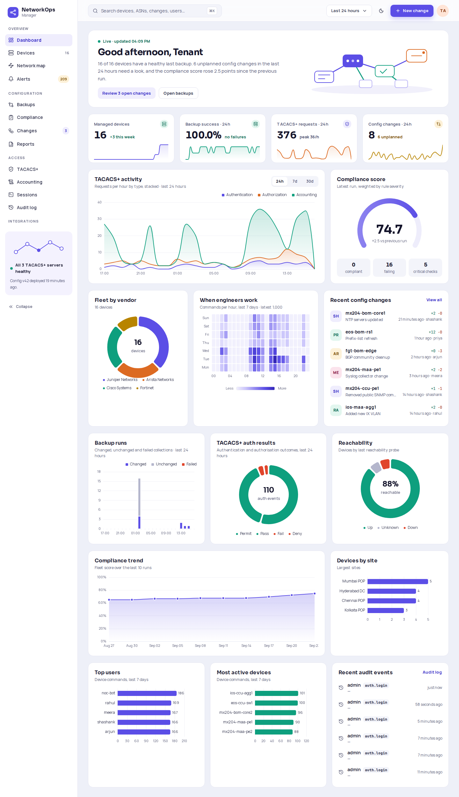
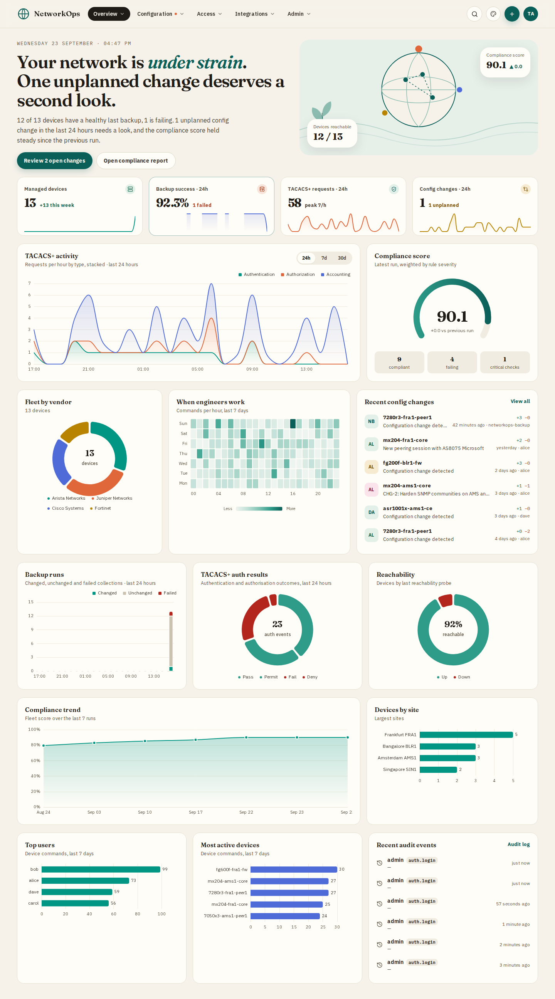

# NetworkOps Manager — Frontend

Web UI for NetworkOps Manager: TACACS+ management, configuration backups in Git, diffs,
compliance, command accounting, session replay, audit, change management and NetBox /
IXP Manager / birdseye integrations.

Built with Next.js 16 (App Router), React 19, TypeScript (strict), Tailwind CSS,
Radix-based shadcn/ui-style components, TanStack Query, Apache ECharts (tree-shaken
`echarts/core`, including the network map), `asciinema-player` and `cmdk`.

Two user-switchable design themes ship, each with light and dark modes:

- **Aurora** (default): Sora / Manrope / JetBrains Mono, indigo brand, left sidebar, inline
  line-art illustrations.
- **Meridian**: warm ivory surfaces, Fraunces serif headings with italic teal accents, IBM Plex
  Sans / Mono, pill-shaped controls, a horizontal pill navigation on desktop, an editorial
  dashboard hero and globe / plant / wave / seal illustrations.

Motion is switched off under `prefers-reduced-motion`. Chart styling and the colour-blind-safe
palettes live in `lib/charts.ts`; data aggregation for charts in `lib/aggregate.ts`.




## Requirements

- Node.js ≥ 20.9 (22 LTS recommended)
- The FastAPI backend from `../backend`, reachable at `http://localhost:8000` in development

## Development

```bash
npm install
npm run dev          # http://localhost:3000, proxies /api/* to API_PROXY_TARGET
```

In development every request to `/api/*` is rewritten to `API_PROXY_TARGET`
(default `http://localhost:8000`), so the browser only talks to the Next.js origin and no
CORS setup is needed.

Sign in with a backend account (e.g. the admin created by `python -m app.cli init`).

## Scripts

| Script              | Purpose                                              |
| ------------------- | ---------------------------------------------------- |
| `npm run dev`       | Development server with hot reload                   |
| `npm run build`     | Production build (`output: "standalone"`)            |
| `npm run lint`      | ESLint (Next.js core-web-vitals + TypeScript rules)  |
| `npm run typecheck` | Generate route types and run `tsc --noEmit`          |
| `npm test`          | Unit tests (Vitest + Testing Library, jsdom)         |

## Environment variables

| Variable              | When       | Default                            | Description                                                                                                                  |
| --------------------- | ---------- | ---------------------------------- | ---------------------------------------------------------------------------------------------------------------------------- |
| `NEXT_PUBLIC_API_URL` | build time | `""`                               | API origin as seen by the browser. Empty means same origin (`/api/v1/...`), which is what the Kubernetes ingress provides.   |
| `API_PROXY_TARGET`    | build/dev  | `http://localhost:8000` in dev     | Backend the Next.js server proxies `/api/*` to. In production it is only used when set at build time (rewrites are baked into the build). |
| `PORT` / `HOSTNAME`   | runtime    | `3000` / `0.0.0.0`                 | Listen address of the standalone server.                                                                                     |

See `.env.example`.

## Production build and Docker

```bash
npm run build
node .next/standalone/server.js      # after copying .next/static and public next to it
```

The Dockerfile does this in three stages (deps → build → runtime) and runs as an
unprivileged user (`nextjs`, uid 1001):

```bash
docker build -t networkops-frontend .
# optional: bake a proxy target for deployments without an ingress
docker build --build-arg API_PROXY_TARGET=http://backend:8000 -t networkops-frontend .
docker run -p 3000:3000 networkops-frontend
```

## Architecture

```
app/
  login/                 sign-in (password, TOTP step-up on `mfa_required`, SSO/OIDC)
  auth/callback/         OIDC redirect target (exchanges code/state for tokens)
  (app)/                 authenticated shell: sidebar, top bar, command palette
    dashboard/ devices/ devices/[id]/ backups/ compliance/ compliance/runs/[id]/
    changes/ changes/[id]/ tacacs/ accounting/ sessions/ sessions/[id]/ audit/
    map/ ixp/ integrations/ alerts/ reports/ users/ users/[id]/ settings/
components/
  ui/                    button, card, input, table, badge, dialog, dropdown-menu, tabs,
                         select, textarea, toast, skeleton, command (cmdk), checkbox, label
  layout/                app shell, sidebar, top bar, command palette, tenant switcher, …
  diff/                  DiffViewer (side-by-side / inline / unified) + risk panel
  common/                page header, empty/error states, pagination, code viewer, …
  devices/ tacacs/ changes/ compliance/ users/ settings/ sessions/ map/ accounting/ charts/
hooks/                   auth context, URL-synced filters, shortcuts, lookups, toasts
lib/
  api.ts                 typed API client (token refresh, tenant header, error mapping)
  types.ts               API types mirroring docs/api/openapi.json
tests/                   Vitest unit tests
```

### Authentication

- `POST /api/v1/auth/login` returns an access/refresh token pair; both are stored in
  `localStorage` (`nom.auth`). A `401` with `detail.code = "mfa_required"` switches the form
  to the one-time-password step.
- Access tokens are refreshed shortly before expiry and on any `401`. Refreshes are
  single-flight per tab and serialised across tabs with the Web Locks API, and the rotated
  refresh token always replaces the old one. A rejected refresh token signs the user out.
- `GET /api/v1/auth/me` provides the permission list; navigation entries and actions the
  user may not perform are hidden (the backend still enforces every permission).
- Superusers get a tenant switcher (populated from `GET /api/v1/tenants`); the selected slug
  is sent as `X-Tenant` on every request and all cached data is dropped on switch.

### Design themes

The theme has two independent axes:

| Axis        | Values                        | Stored as                                          | Applied as                          |
| ----------- | ----------------------------- | -------------------------------------------------- | ----------------------------------- |
| Design      | `aurora` / `meridian`         | `localStorage["nom.design"]` + cookie `nom-design` | `data-design` on `<html>`           |
| Colour mode | `light` / `dark` / `system`   | `localStorage["theme"]` (next-themes)              | `.dark` class on `<html>`           |

- `app/globals.css` declares every token (colours as HSL triplets, plus fonts, radii, shadows
  and illustration colours) for `:root` (Aurora light), `.dark`, `[data-design="meridian"]` and
  `[data-design="meridian"].dark`. `tailwind.config.ts` maps colours, `rounded-*` and
  `font-sans/display/mono` to those variables, so components switch without branching.
  `meridian:` / `aurora:` Tailwind variants cover the few CSS-only structural differences.
- All six font families are loaded with `next/font` as CSS variables; the design picks which
  ones `--font-display`, `--font-body` and `--font-code` point at.
- An inline script in `app/layout.tsx` (`DESIGN_INIT_SCRIPT` in `lib/theme.ts`) sets
  `data-design` before first paint. `hooks/use-design.ts` reads the attribute with
  `useSyncExternalStore` (so every consumer re-renders together, across tabs too) and exposes
  `useDesign()`, `useColorMode()` and `useChartTheme()`.
- Structural variants: the app shell (`components/layout/app-shell.tsx` renders the Aurora
  sidebar or `meridian-header.tsx`; both use the nav model in `components/layout/nav-model.ts`),
  `PageHeader`, the dashboard hero, the compliance fleet-score card and "Most-failed rules".
- Charts: `lib/charts.ts` holds one `ChartTheme` token object per design × mode (categorical
  palette in fixed order, sequential ramp, diverging pair, status and severity colours, fonts,
  tooltip style, axis colours). Builders take the theme (or a bare mode, meaning Aurora); pages
  get it from `useChartTheme()` and rebuild options when it changes (`setOption` with
  `notMerge`).
- Switch themes from the palette menu in the top bar, Settings → Appearance, the command
  palette ("Switch to Meridian theme") or `t t`.

### Keyboard shortcuts

| Keys             | Action                      |
| ---------------- | --------------------------- |
| `⌘K` / `Ctrl+K`  | Search / command palette    |
| `g d`            | Dashboard                   |
| `g v`            | Devices                     |
| `g b`            | Backups                     |
| `g c`            | Changes                     |
| `g a`            | Audit log                   |
| `t t`            | Toggle design theme         |
| `?`              | Shortcut help               |

## Tests

`tests/theme-contrast.test.ts` parses `app/globals.css` and asserts WCAG AA (4.5:1) for every
text/background token pair in all four design × mode combinations, plus chart text and 3:1
for categorical chart colours; `tests/chart-themes.test.ts` checks that options differ per theme,
that palettes keep their fixed order, that chart builders contain no hard-coded colours, and that
the design is restored from localStorage / cookie before paint.
`tests/diff-viewer.test.tsx` covers the diff viewer (row types, colours, intraline
highlighting, mode switching, risk panel) and `tests/api-client.test.ts` covers the API
client (bearer/tenant headers, proactive and 401-triggered refresh, refresh-token rotation,
single-flight refresh, logout on rejected refresh, `mfa_required` and validation errors).
